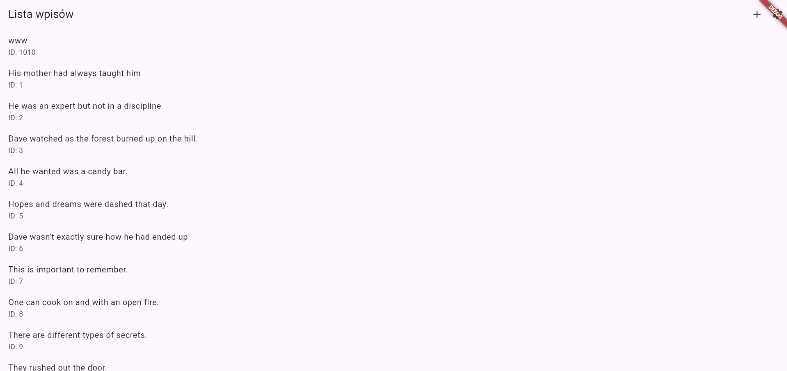
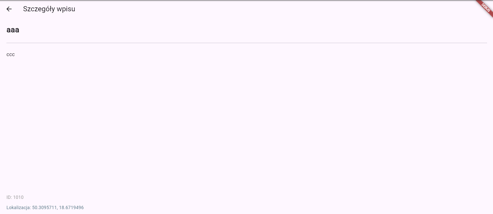
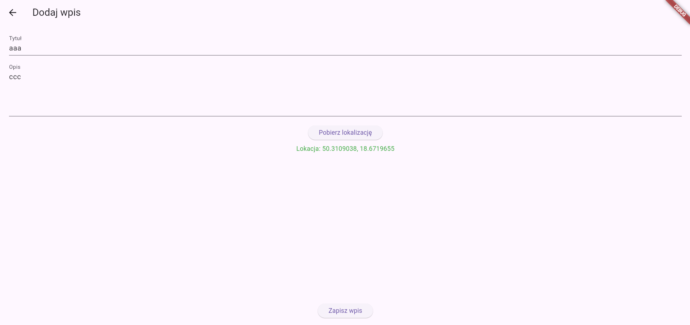
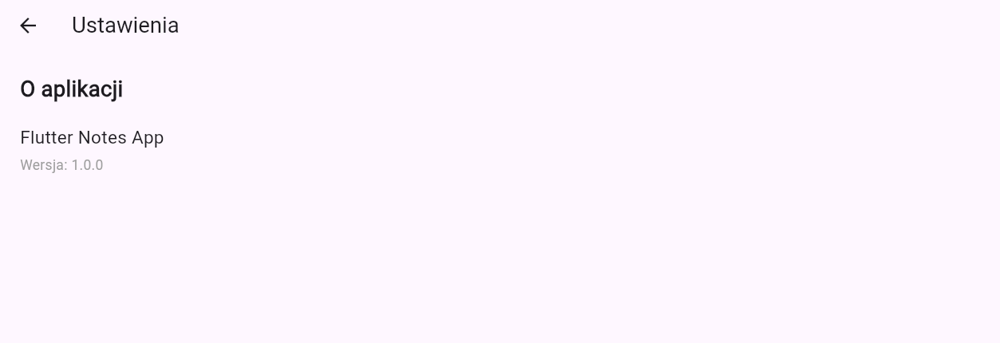

# Flutter Notes App

## Funkcje aplikacji

- Pobieranie listy wpisów z API (DummyJSON)
- Wyświetlanie szczegółów wybranego wpisu
- Dodawanie własnego wpisu z pobraniem lokalizacji GPS
- Prosta nawigacja między ekranami
- Ekran ustawień z podstawowymi informacjami o aplikacji
- Wykorzystanie natywnej funkcji urządzenia – geolokalizacji

## Struktura ekranów
**HomeScreen (lista wpisów)**

Pobiera dane z API i wyświetla listę wpisów
Przejście do szczegółów po kliknięciu
Przycisk „+” umożliwia dodanie wpisu
Przycisk ustawień prowadzi do ekranu Settings

**DetailScreen (szczegóły wpisu)**

Dla wpisów z API – pobieranie szczegółowych danych
Dla wpisów dodanych lokalnie – wyświetlanie zapisanych danych
Wyświetlanie: tytułu, treści, identyfikatora oraz Lokalizacji

**AddEntryScreen (dodawanie wpisu)**

Pola tekstowe: tytuł i opis
Pobieranie bieżącej lokalizacji użytkownika
Zapis danych i dodanie ich do listy na ekranie głównym

**SettingsScreen (ustawienia)**

Nazwa aplikacji
Wersja aplikacji (1.0.0)

**Natywna funkcja — lokalizacja GPS**

Aplikacja wykorzystuje pakiet geolocator do:
- sprawdzania uprawnień do lokalizacji,
- proszenia użytkownika o dostęp,
- pobierania aktualnych współrzędnych GPS,
- wyświetlania ich w szczegółach wpisu,
- przesyłania ich z formularza dodawania wpisu.

**API**

Aplikacja korzysta z darmowego DummyJSON API.
Lista wpisów:

GET https://dummyjson.com/posts?limit=10

Szczegóły wpisu:

GET https://dummyjson.com/posts/{id}

Dla wpisów lokalnych (z ID większym niż 1000) dane nie są pobierane z API.

## Technologie

Flutter 3.38
Dart 3
Pakiet http do komunikacji z API
Pakiet geolocator do pobierania lokalizacji
Material Design 3
Navigator API (routing oparty o nazwy ścieżek)

## Jak uruchomić projekt

Zainstalować Flutter w systemie
Włączyć w Windows ustawienie „Tryb deweloperski”
W katalogu projektu wykonać:

**flutter pub get**

Uruchomić aplikację:

**flutter run**

## Zrzuty ekranu

### Ekran główny

### Szczegóły wpisu

### Dodawanie wpisu

### Ustawienia
